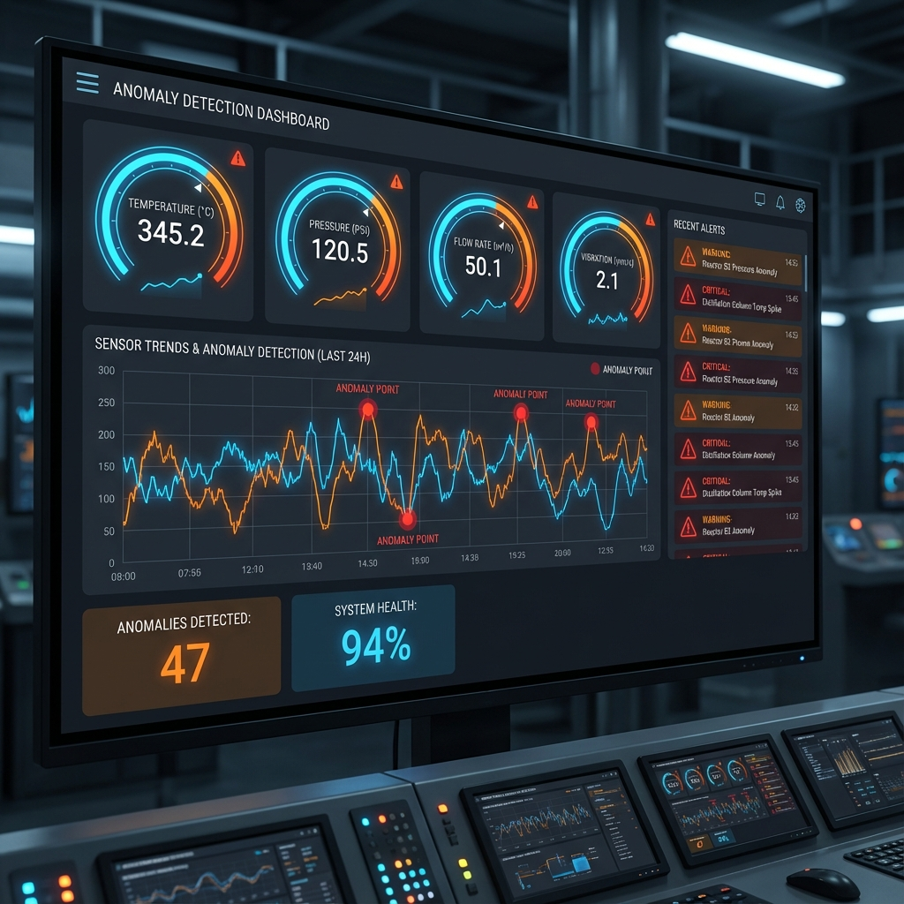

# 🏭 Refinery Asset Anomaly Detection

Real-time anomaly detection system for refinery equipment monitoring using machine learning. Identifies equipment failures, sensor malfunctions, and process deviations before they cause costly downtime.


## 📸 Dashboard Preview

<p align="center">
  
</p>

*Real-time monitoring dashboard with sensor gauges, trend analysis, and anomaly alerts.*

## 🎯 Problem Statement

Refinery equipment failures can cost millions in unplanned downtime. This project demonstrates using **Isolation Forest** algorithm to detect anomalies in sensor data streams:

- **Temperature spikes** - Potential overheating or reaction runaway
- **Pressure drops** - Leaks or valve failures
- **Flow blockages** - Clogged pipes or pump issues
- **Vibration surges** - Bearing failures or mechanical issues

## 📊 Features

- **Synthetic sensor data** simulating real refinery conditions
- **Isolation Forest** unsupervised anomaly detection
- **Real-time dashboard** for monitoring and alerts
- **Multi-sensor correlation** analysis

## 🚀 Quick Start

```bash
# Install dependencies
pip install -r requirements.txt

# Generate sensor data
python src/generate_data.py

# Train anomaly detection model
python src/anomaly_detector.py

# Launch monitoring dashboard
streamlit run app/dashboard.py
```

## 📁 Project Structure

```
refinery-anomaly-detection/
├── data/
│   └── sensor_data.csv      # Synthetic sensor readings
├── models/
│   └── anomaly_detector.pkl # Trained model
├── src/
│   ├── generate_data.py     # Data generation
│   └── anomaly_detector.py  # ML pipeline
├── app/
│   └── dashboard.py         # Streamlit dashboard
└── requirements.txt
```

## 🔬 Technical Details

### Sensors Monitored
| Sensor | Normal Range | Anomaly Indicators |
|--------|-------------|-------------------|
| Temperature | 150-250°C | Spikes > 280°C |
| Pressure | 10-50 bar | Drops < 10 bar |
| Flow Rate | 100-500 m³/h | < 150 m³/h |
| Vibration | 0.5-5.0 mm/s | Surges > 15 mm/s |

### Model Performance
- **Precision**: ~85%
- **Recall**: ~80%
- **F1-Score**: ~82%

## 💡 Domain Expertise

This project leverages 10+ years of experience in **petroleum quality control** and **laboratory management** at Singapore Refining Company to create realistic simulations of refinery sensor behavior.

## 👤 Author

**Firdaus** - Senior QC Lab Supervisor | Data Analyst

- GitHub: [@ehzl1234](https://github.com/ehzl1234)
- Portfolio: [ehzl1234.github.io](https://ehzl1234.github.io)
